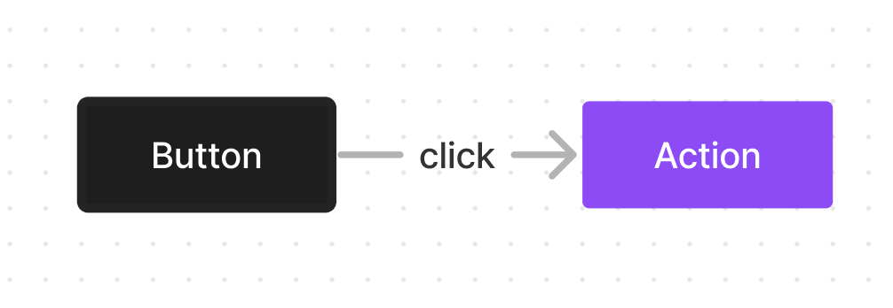
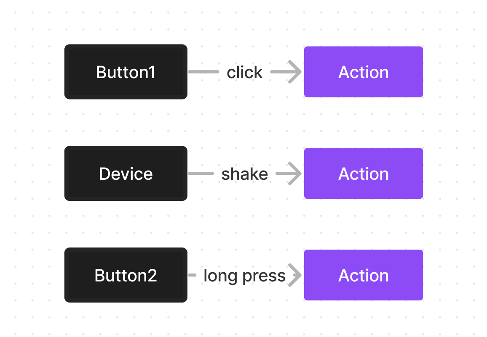
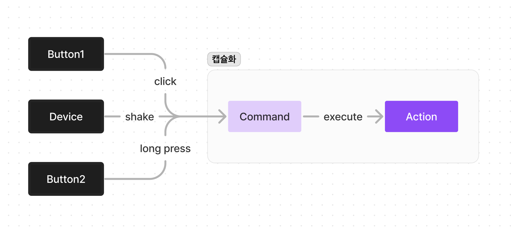
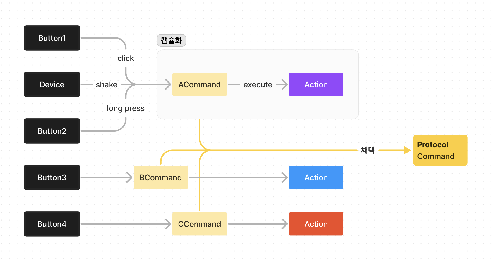
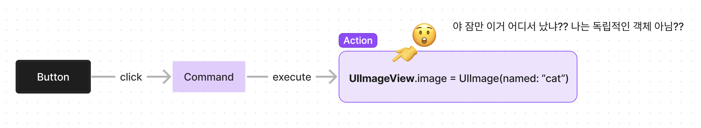
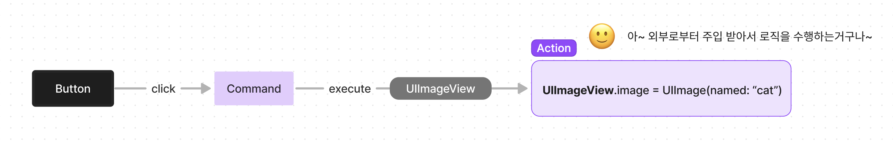
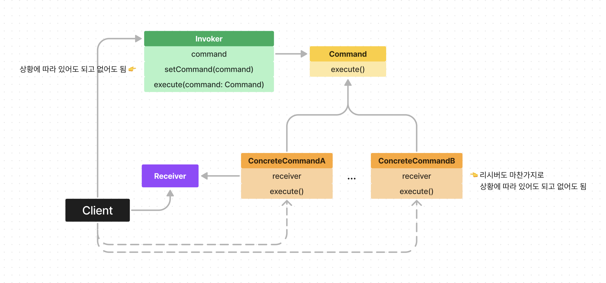

# Command pattern

커맨드 패턴은 어떠한 요청에 대한 로직을 캡슐화 하는 것을 의미합니다.

뭔소리지? 싶으실겁니다. (저도 마찬가지입니다)

자 예를들어볼게요. 우리 보통 버튼을 만들면 그 버튼을 눌렀을 때 실행되는 로직이 버튼이랑 밀접하게 연관되어있죠?

아래 그림처럼 말이죠!



근데 만약 나의 아이폰을 흔들어재꼈을 때에도 같은 동작을 수행하고 싶다고 해볼게요.

그럼 버튼을 클릭했을 때의 실행되는 로직과 똑같은 로직을 또 구현해줘야할 겁니다.

이런게 몇 개 안된다면 그냥 복붙해서 사용해도 괜찮겠지만 많은 버튼과 중복되는 액션들이 존재한다면 유지보수가 쉽지 않을겁니다.



</br>

그래서 이러한 문제를 해결할 수 있는 패턴으로 커맨드 패턴이 존재합니다!

위에서 말했듯 어떠한 로직을 캡슐화 시킨다 그랬었죠?

따라서 어떠한 요청에 대해서 직접 로직을 실행하는게 아니라! 커맨드를 통해서 실행하는 것 입니다!



커맨드 패턴의 기저는 이렇고 구현은 보통 단일 커맨드 인터페이스를 생성하고 콘크리트 커맨드들(커맨드 인터페이스를 채택하는 객체들)을 만들어서 로직을 실행시킵니다.



</br>

## 독립된 객체에서 로직을 어떻게 실행 시킨다는거임?

여기에서 의문점이 생기신 분들도 계실겁니다.

잠만.. 로직을 캡슐화 한다고 했지.. 그럼 Action 저게 어떠한 로직을 의미하는거고.. 그렇다면 만약 로직이 ```UIImageView.image = UIImage(...)``` 와 같이UI 요소를 업데이트 하는 로직이라면 캡슐화 되어있어서 어떻게 UIImageView 같은거에 접근 못하는거 아님??



네! 맞습니다.

캡슐화 된 로직이 완전히 독립적일 수는 없습니다.

그렇기에 아래 그림처럼 커맨드 패턴에서는 외부로부터 의존성을 주입받는 경우가 흔합니다.

여기에서 UIImageView처럼 주입받는 녀석을 보통 "리시버" 라고 부릅니다.



</br>

## 구조

커맨드 패턴의 전통적인 구조를 보면서 앞서 설명한 것들을 조금 정리하는 시간을 가져보도록 하죠.



전반적인 구조는 위와 같습니다.

초반에 얘기했던 Command 추상화 객체,

그리고 그걸 채택하여 구현하는 Concrete Command들,

UIImageView와 같이 로직에 포함되는 리시버 등등 보이네요.

</br>

### 근데 Invoker는 뭘까요?

Invoker는 말 그대로 호출자 역할을 하는 녀석 입니다.

Invoker는 커맨드를 생성하는 책임을 가지진 않고 Command를 주입 받아서 대신 실행 시켜주는 녀석인 것이죠.

얘가 필요한 이유는 커맨드에 대한 객체의 참조를 유지시켜주기 위함 입니다.

만약 Invoker 없이 사용한다면 ConcreteCommandA() 이렇게 커맨드를 생성한 후에 execute()을 바로 호출할 수 있겠죠?

```Swift
func action() {
  let command = ConcreteCommandA()
  command.execute()
}
```

이렇게 된다면 action() 함수가 종료됨과 동시에 command 객체도 함께 메모리에서 해제되어 다른 곳에서 해당 커맨드를 참조하거나 재사용할 수 없게 되는 상황을 의미합니다.

따라서 이를 방지하기 위해서 Invoker가 존재하는 것이죠.

이런 기능 뿐만 아니라 Invoker는 클라이언트로부터 호출받은 excute(command: Command)를 실행할 때마다 주입받은 command를 배열로 저장해서 각 커맨드를 undo() 시킬 수도 있습니다.

(다만 이렇게 하려면 Command protocol에 execute()뿐만 아니라 undo() 함수도 정의되어 있어야함)

</br>

## IRL (In Real Life)

이정도면 커멘드 패턴이 대략 어떻게 작동하는지에 대해서는 감 잡으셨을거라 생각합니다.

그럼 실제로 커맨드 패턴을 이용해서 프로젝트를 만들어 볼까요?

</br>

저는 간단하게 이미지를 수정할 수 있는 로직을 커맨드 패턴으로 캡슐화 한 후 Invokder도 구현해서 undo 기능까지 구현해 보겠습니다.

우선 Command protocol을 만들어 주겠습니다.

execute() 뿐만 아니라 되돌리기 기능을 위해서 undo() 함수도 정의해 주겠습니다.

```Swift
protocol ImageEditCommand {
  func execute(with originalImage: UIImage?)
  func undo()
}
```

<br>
자 다음으로 ConcreteCommand들 구현해 주겠습니다.

(자세한 구현은 예시 프로젝트 파일에서 확인 부탁드릴게요🙏)

```Swift
class ApplyCornerRadiusCommand: ImageEditCommand {
  private weak var imageView: UIImageView?  // <- 얘가 이제 Receiver
  private let cornerRadius: CGFloat
  private var previousCornerRadius: CGFloat = 0
  
  init(imageView: UIImageView, cornerRadius: CGFloat) {
    self.imageView = imageView
    self.cornerRadius = cornerRadius
    self.previousCornerRadius = imageView.layer.cornerRadius // 이전 상태 저장
  }
  
  func execute(with originalImage: UIImage?) {
    // 이미지 corner radius 수정해주는 로직
  }
  
  func undo() {
    // 뒤로가기 로직
  }
}

class AdjustBrightnessCommand: ImageEditCommand {
  private let imageView: UIImageView // <-  Receiver
  private let brightness: Float // -1.0에서 1.0 사이의 범위
  private var previousImage: UIImage?
  
  init(imageView: UIImageView, brightness: Float) {
    self.imageView = imageView
    self.brightness = brightness
  }
  
  func execute(with originalImage: UIImage?) {
    // 이미지 corner radius 수정해주는 로직
  }
  
  func undo() {
    // 뒤로가기 로직
  }
}
```

<br>

마지막으로 Invoker를 구현해 주겠습니다.

```Swift
class ImageEditor {
  private var imageView: UIImageView
  var originalImage: UIImage?
  private var commandHistory: [ImageEditCommand] = []
  private var previousImage: UIImage?
  
  init(imageView: UIImageView) {
    self.imageView = imageView
    self.originalImage = imageView.image
  }
  
  func execute(command: ImageEditCommand) {
    previousImage = imageView.image
    command.execute(with: originalImage)
    commandHistory.append(command)
  }
  
  func undo() {
    guard !commandHistory.isEmpty else { return }
    let lastCommand = commandHistory.removeLast()
    lastCommand.undo()
    if let previous = previousImage {
      imageView.image = previous
    }
  }
}
```

이 ImageEditor라는 Invoker를 구현해줬는데요, 앞서 설명한대로 execute()를 대신 실행해줄 때마다 commandHistory 배열에 저장해주면서 참조를 유지해주고 있습니다.

이렇게 하면 커맨드 배열 history를 가지고 undo()를 이용해서 뒤로가기 기능도 구현 가능하겠죠?

<br>

이제 클라이언트 쪽에서는 아래와같이 사용해주면 됩니다.

보시면 커맨드를 생성해주는건 클라이언트의 몫이고, 실행 자체는 ImageEditor(Invoker) 를 통해서 대신 호출하는 것을 보실 수 있습니다.

```Swift
class ViewController: UIViewController {
  var imageEditor: ImageEditor!
  var originalImage = UIImage(named: "cat")

  override func viewDidLoad() {
    override func viewDidLoad()
    self.imageEditor = ImageEditor(imageView: catImageView)
  }
  
  @IBAction func didTapUndoButton(_ sender: Any) {
    imageEditor.undo()
  }
  
  @IBAction func didChangeCornerRadiusValue(_ sender: UISlider) {
    let command = ApplyCornerRadiusCommand(imageView: catImageView, cornerRadius: CGFloat(sender.value))
    imageEditor.execute(command: command)
  }
  
  @IBAction func didChangeBrightnessValue(_ sender: UISlider) {
    let command = AdjustBrightnessCommand(imageView: catImageView, brightness: sender.value)
    imageEditor.execute(command: command)
  }
}
```

### 실행 화면


## 마치며

어떤가요? 실제로 구현해보시면 생각보다 간단하단걸 아실 수 있을겁니다!

다만 다양한 상황에서 리시버를 수정하는 로직을 완전히 캡슐화 하기란 조금 어려울 수도 있겠다고 느꼈는데요

이런 부분들은 다른 패턴들을 같이 조합하면 더 유연한 구조로 만들 수 있다고 하니까 지금 당장 만들러 가보세요~! 🏃‍♂️
