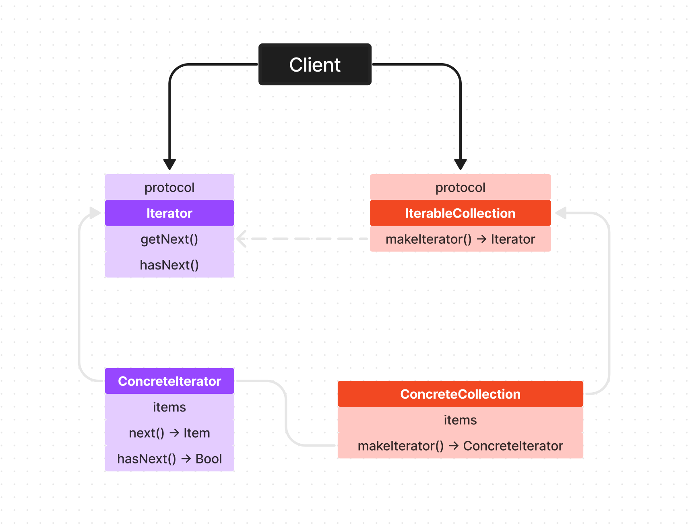

# Iterator Pattern

Iterator 패턴 즉 반복자 패턴의 정의부터 보고 가겠습니다.

> 반복자 패턴은 컬렉션의 구현 방법을 노출하지 않으면서 집합체 내의 모든 항목에 접근하는 방법을 제공합니다.

by 헤드퍼스트 디자인 패턴

자 이게 뭔 소리일까요?

우리가 평소에 Collection의 타입이 **Dictionary**이든 **Array**이든 상관없이 ```for in``` 구문이나 ```forEach```를 사용해왔었죠?

이렇게 타입에 상관 없이 반복문을 사용할 수 있었던 것이 Iterator 패턴을 사용하고 있었기 때문 이라고 얘기할 수 있는 것이죠.

그럼 정의와 함께 비교해보자면
> 반복자 패턴은 컬렉션의 구현 방법을 노출하지 않으면서...

이건 컬렉션의 타입이 Dictionary이든 Array이든 컬렉션 타입 상관 없이 라고 해석할 수 있겠군요

왜냐하면 ```forEach```나 ```for in```구문을 사용하지 않는다면 어떻게 접근할까요?

접근하는 방법에 대해서 알고있어야 할 겁니다. Dictionary가 [Int: String] 이런 타입으로 구현 되어있었다면 key 값의 범위를 알고 어떻게 접근해야하는지에 대해서 알고있어야 한다거나를 얘기하는 것이죠.

하지만 ```forEach```나 ```for in```을 이용하면 이게 어떻게 구현되어있어서 어떻게 각각 요소에 접근해야하는지 알 필요 있었나요? 없었죠! 바로 이걸 의미하는 겁니다.

이렇게 컬렉션이 어떻게 구현 되어있는지 몰라도! 모든 컬렉션 요소에 접근할 수 있도록 도와주는 것이 바로! Iterator(반복자) 패턴이다~ 이렇게 애해해 주시면 되겠습니다.

</br>

## 전통적인 구현 방식

우선 Iterator 패턴의 구조는 아래와같습니다.



ConcreteCollection을 구현한 후 내부에서 makeIterator를 호출해서

아래와 같이 while문 등을 이용해서 사용하는 것이죠.

```Swift
let collection = ConcreateCollection(items: [...])
let iterator = collection.makeIterator()

while let item = iterator.next() {
  item.doSeomthing()
}
```

이렇게 하면 IterableCollection을 채택한 또 다른 ConcreteCollection만 구현한다면 while 문 쪽은 변경하지 않고 iterator만 교체해주면서 사용할 수 있겠죠?

Iterator가 없었다면 Collection 타입에 따라서 while문 쪽(순회하는 로직)이 자주 변경이 될 텐데 Iterator를 이용하면서 Collection을 감추고 while문 쪽을 변경하지 않으면서 확장할 수 있게 된거죠.

이를 Iterator패턴을 이용해서 자주 변경되는 순회 로직을 캡슐화 시켰다~ 라고 말할 수 있는 겁니다.

어떻게 보면 Iterator가 통일된 방식으로 컬렉션의 요소를 한번씩 대신 순회 해주는 셔틀? 느낌으로 봐도 상관없을 듯 합니다 🫠

</br>
</br>

자! 그럼 대충 구조는 알았으니 Iterator와 IterableCollection을 직접 구현해 봅시다.

그냥 구현하면 재미없으니 순차적으로 DBMigration 하는 로직을 Iterator를 이용해서 구현해볼게요.

</br>

### Iterator 구현

Iterator를 구현해주기 전에 Iterator에서 collection Item으로 사용할 MigrationStep들을 문저 구현해 주겠습니다.

```Swift
protocol MigrationStep {
  func migrate()
}

struct V1_to_V2: MigrationStep {
  func migrate() {
    print("버전 1 에서 버전2 로 마이그레이션 완료")
  }
}

struct V2_to_V3: MigrationStep {
  func migrate() {
    print("버전 2 에서 버전3 로 마이그레이션 완료")
  }
}
```

이어서 위에서 봤던 그림과 같이 Iterator 프로토콜을 만들고 채택해 주겠습니다.

사실 Iterator를 직접 구현하지 않아도 되는게 Foundation에 이미 포함되어있는 프로토콜 입니다.

이름은 IteratorProtocol 이죠.

이걸 채택하면 next() 를 구현해야할 겁니다.

그런데 haxNext()는 없는데요, 개인적인 추측이지만 Swift에는 optional이 있기 때문에 이를 이용하면 굳이 hasNext()를 구현해주지 않고도 옵셔널을 언래핑 해서 값이 없으면 nil을 리턴해 주는 방식으로 자연스럽게 사용할 수 있기 때문에 hasNext() 함수가 Iterator Protocol에 포함이 되어있지 않은게 아닌가 싶네요!

일단 저는 구현해 주겠습니다.

```Swift
struct MigrationIterator: IteratorProtocol {

  let steps: [MigrationStep]
  var currentIndex = 0
  
  mutating
  func next() -> MigrationStep? {
    if hasNext() {
      let step = steps[currentIndex]
      currentIndex += 1
      return step
    } else {
      return nil
    }
  }
  
  func hasNext() -> Bool {
    return currentIndex < steps.count
  }
}
```

자 이렇게 구현하면 Iterator를 가져와서 반복문 돌리는 곳에서는 next()를 계속 호출해서 옵셔널이 아닐 때까지 요소를 하나씩 가져와서 사용할 수 있겠죠?

</br>

### Collection 구현

마지막으로 Collection쪽 구현해 보겠습니다.

여기에서도 IterableCollection을 프로토콜을 직접 작성할 수 있겠지만 똑같은 역할 하는 Seqeunce라는 프로토콜이 있는데 얘를 그냥 채택하자구요. 그러면 makeIterator() 라는 함수를 꼭 구현해줘야할겁니다. 아래처럼요!

```Swift
struct MigrationCollection {
  private var steps: [MigrationStep]
  
  init(steps: [MigrationStep]) {
    self.steps = steps
  }
  
  func makeIterator() -> MigrationIterator {
    return MigrationIterator(steps: steps)
  }
}
```

자 모든 준비가 끝났으니 사용해 볼까요??

```Swift
let collection = MigrationCollection(steps: [
  V1_to_V2(),
  V2_to_V3()
])

var iterator = collection.makeIterator()
for next in iterator {
  next.migrate()
}

// 실행 결과
// 버전 1 에서 버전2 로 마이그레이션 완료
// 버전 2 에서 버전3 로 마이그레이션 완료
```

짜잔~~

아까 IterableCollection 프로토콜 대신 Sequence(같은 역할하는데 이미 만들어진 거)를 채택해줬기 때문에 아래와같이 사용도 가능합니다.

```Swift
iterator.forEach { item in ... }

//또는

for item in iterator { ... }
```

</br>

## IRL (In Real Life)

사실 위에서 구현한 것은 아래와같이 사용한 것과 별반 다른게 없긴 합니다.

왜냐하면 MigrationCollection도 어차피 item을 배열로 가지고 있고 이 배열도 어차피 Iterator 패턴이 적용된 Collection이기 때문에 Iterator 패턴을 적용한 Collection을 한 번 더 감싼 그런 느낌?

```Swift
let items = [V1_to_V2(), V2_to_V3()]
items.forEach { ... }
```

어쨌든 Iterator 패턴이 서로 다른 타입의 컬렉션의 순회를 캡슐화 해서 확장을 도와주는 것을 기저로 하고있는데 뭐 이미 Foundation 수준에서 구현도 되어있고.. 저는 Iterator 패턴을 좀 다른 방식으로 응용해 보겠습니다.

일반적으로 생각해 봤을때 Migration은 버전 ```1 -> 2```, ```2 -> 3``` ... 이런 식으로 하게 됩니다.

근데 만약 DB 버전 ```1``` 사용자들이 중간에 ```1 -> 2``` 마이그레이션이 포함된 업데이트를 다운받지 않은 상태에서 ```2 -> 3``` 마이그레이션을 해버릴 경우 참사가 일어나겠죠?

따라서 현재 버전이 ```1```인 사용자들에게 ```1 -> 2``` 마이그레이션을 꼭 거친 후에 ```2 -> 3``` 마이그레이션을 하도록 해야합니다.

자 이련 경우 Iterator 패턴을 유용하게 사용할 수 있습니다!!

그럼 바로 구현해 봅시다!

우선 Migration Step에 migrationVersion 프로퍼티를 추가해 주도록 하겠습니다.

```Swift
protocol MigrationStep {
  var migrationVersion: Int { get }
  func migrate()
}
```

핵심은 다음인데 바로 아래처럼 MigrationCollection에 현재 버전과 타켓 버전을 초기화 인자로 받고 makeIterator() 할 때 마이그레이션에 필요한 MigrationStep만 필터링 해 주는 것이죠.
(필요시 version에 따라서 정렬도 해줘야함)

```Swift
struct MigrationCollection: Sequence {
  private var steps: [MigrationStep]
  private let currentVersion: Int
  private let targetVersion: Int
  
  init(steps: [MigrationStep], currentVersion: Int, targetVersion: Int) {
    self.steps = steps
    self.currentVersion = currentVersion
    self.targetVersion = targetVersion
  }
  
  func makeIterator() -> MigrationIterator {
    let filteredSteps = steps.filter { $0.migrationVersion > currentVersion && $0.migrationVersion <= targetVersion }
    return MigrationIterator(steps: filteredSteps)
  }
}
```

그리고 아래와같이 사용해 보면! 시작 버전과 끝 버전에 맞게 마이그레이션 된 모습 보이시죠?

이렇게 써먹을 수도 있겠습니다.

```Swift
let collection = MigrationCollection(steps: [
  V1_to_V2(),
  V2_to_V3(),
  V3_to_V4(),
  V4_to_V5()
], currentVersion: 2, targetVersion: 4)

var iterator = collection.makeIterator()
for next in iterator {
  next.migrate()
}

// 실행 결과
// 버전 3 에서 버전4 로 마이그레이션 완료.
// 버전 4 에서 버전5 로 마이그레이션 완료.
```

steps에 모든 마이그레이션 객체를 초기화 해서 배열로 넣는 것이 메모리 측면에서 낭비가 발생할 수 있는 환경이라면 MigrationStep과 enum의 rawValue를 잘 조합해서 필요한 MigrationStep만 초기화 시켜서 사용할 수도 있습니다.

사실 뭐 정답이 없는거라 현재 환경과 취향것 응용해서 사용하시면 좋을것 같습니다 🙂
