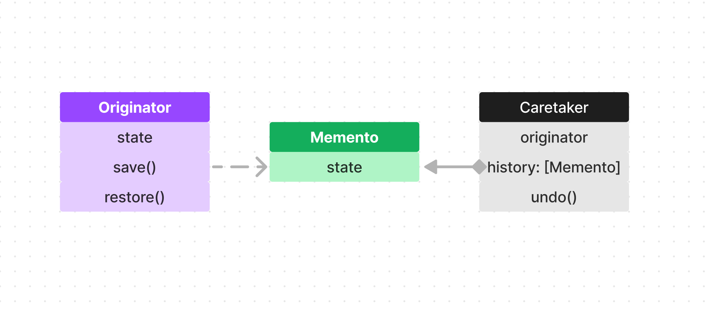
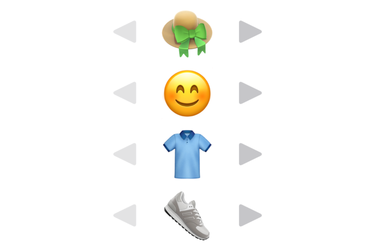
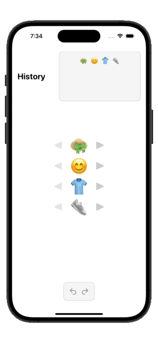

# Memento pattern

메멘토는 위키백과에 의하면 "기억의 증표"를 뜻한다고 합니다.

메멘토의 핵심 의도도 이와 비슷한데요! 바로 상태의 저장과 복원을 도와주는 디자인 패턴이 바로 메멘토인 것이죠.

우리 그림판에서 그림 그리고 마음에 안 들면 undo, redo 이런거 자주 사용하잖아요?

바로 이런 기능을 메멘토를 이용하여 구현할 수 있습니다!

메멘토의 특징을 하나 더 얘기해 보자면 메멘토를 이용하면 객체의 세부사항을 공개하지 않아도 된다는 건데요.

이게 무슨 말인지는 아직 잘 와닿지 않을 겁니다.

이는 메멘토의 구조와 사용 예시를 같이 보면서 이해해 보자구요~

</br>

## 구조



우선 구조는 위와 같습니다.

### Originator

Originator는 상태를 저장하고 복원할 수 있는 역할을 합니다.

그냥 클라이언트 쪽이라고 생각해도 무방할 것 같습니다.

개발하는 환경에 따라서 다르겠지만 뷰가 있는 환경이라면 뷰에서 이 origiantor를 구현하고 있어도 무방하다고 생각합니다.

(뷰에서 저장 버튼을 누르면 save() 하고, 복구 버튼 누르면 restore() 바로 할 수 있기 때문에 간단한 구조에서는 굳이 레이어를 하나 더 나누는 것이 의미가 있나 싶음)

### Memento

메멘토는 스냅샷 역할을 하는 객체입니다.

그러니까 동영상의 한 장면 이라고 생각하시면 좋을것 같습니다.

이런 장면이란 단위가 존재하기 때문에 undo() redo() 액션이 존재할 수 있는거겠죠?

다른 다이어그램에는 getState()같은것도 있는데 어떻게 구조화 해서 사용하느냐에 따라서 다른 부분입니다. 너무 정해진 구조에 얽메이지 마셔도 됩니다! (Originator, Caretaker도 마찬가지)

### Caretaker

Caretaker는 보이는 것처럼 history를 가지고있죠? 요소는 Memento이구요,

즉 memento(스냅샷) 기록들을 모두 가지고 있고 이를 undo(), redo() 할 수 있게 도와주는 실질적인 객체인 셈이죠.

앞에서 저는 Originator를 그냥 뷰에서 구현해서 사용한다고 했었죠? 이런 상황에서 CareTaker를 뷰모델의 역할 정도로 이해하시면 될 것 같습니다.

</br>

## IRL (In Real Life)

메멘토가 뭐하는 녀석인지도, 구조도 알았으니 한 번 메멘토 패턴을 이용해서 뭔가 만들어 봅시다!

저는 이모티콘으로 옷입히기 게임이나 함 만들어보겠습니다.



일단 상태를 가지고있는 스냅샷 즉 메멘토 객체를 만들어 주겠습니다.

```Swift
struct Memento: Equatable {
  var hat: String
  var face: String
  var cloth: String
  var shoes: String
}
```

</br>

그리고 Caretaker 역할을 할 녀석을 만들어줘보죠.

저는 이 Caretaker를 SwiftUI View에서 바로 가져다 사용할 것이기 때문에 ObservableObject로 구현해 줬습니다.

```Swift
final class CareTaker: ObservableObject {
  
  // MARK: - Properties
  
  @Published var settingHistory: [Memento] = []
  private var currentIndex = 0 {
    didSet {
      self.currentSettings = settingHistory[currentIndex]
    }
  }
  
  @Published var currentSettings: Memento
  
  
  // MARK: - Initializers
  
  init(initialSettings: Memento) {
    self.currentSettings = initialSettings
    settingHistory.append(initialSettings)
  }
}
```

그리고 여기에 save() undo() redo() 로직을 구현해 줘 보겠습니다.

```Swift
  func save(settings: Memento) {
    if currentIndex < settingsHistory.count - 1 {
      settingsHistory = Array(settingsHistory.prefix(upTo: currentIndex + 1))
    }
    settingsHistory.append(settings)
    currentIndex = settingsHistory.count - 1
  }
  
  func undo() {
    if isUndoAvailable() {
      currentIndex -= 1
    }
  }
  
  func redo() {
    if isRedoAvailable() {
      currentIndex += 1
    }
  }
  
  func isUndoAvailable() -> Bool {
    currentIndex > 0 ? true : false
  }
  
  func isRedoAvailable() -> Bool {
    currentIndex < settingsHistory.count - 1 ? true : false
  }
```

save 함수 안에 거추장스러운 if 분기가 있는데 저건 undo를 몇 번 실행하면 redo할 수 있는 스냅샷들이 currentIndex 후 배열 뒷 부분에 존재할텐데 새로운 스냅샷이 생기면 그 뒷 부분에 존재하던 스냅샷들은 필요 없으니까 버려주는 역할을 합니다.

어쨌든 필수 구현 요소들은 다 구현할 것 같네요.

그럼 이어서 뷰들도 만들고 적절히 Caretaker 함수들 호출해 주고(자세한건 Example폴더 내에 있음) 실행해 보면 아래와같이 메멘토 패턴을 이용해서 undo(), redo() 기능을 구현한 모습을 보실 수 있습니다.



꼭 옷 입히기가 아니더라도 스냅샷을 만들어 되돌아가기 등등 (예를들면 인스타그램 스토리 만들기) 다양한 경우에 메멘토 패턴을 활용해 볼 수 있으니까 지금 당장 만들러 가보세요~
