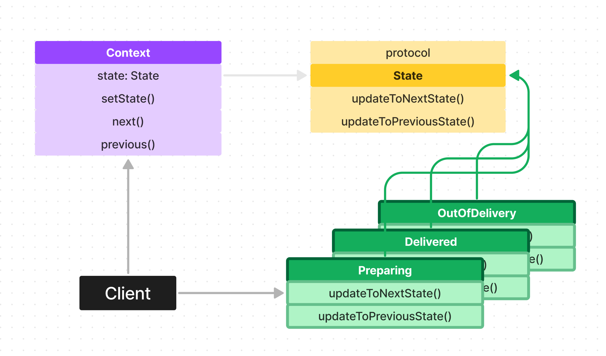
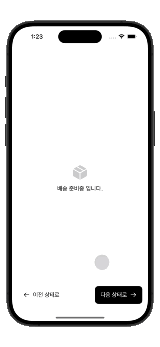

# State Pattern

이번에는 상태 패턴에 대해서 알아보겠습니다.

상태 패턴이라고 하면 이름 때문에 SwiftUI의 Published 객체나 Combine, Rx의 스트림이 있고 그걸 구독해서 사용하는 것을 상태 패턴이라고 오해하실 수 있습니다.

뭐 "상태 어떻게 정의하느냐에 따라서 달라질 수 있겠지만 지금 여기에서 얘기하려는 상태 패턴은 조금 다르니까 기존에 알고 있던 상태와는 별개로 생각해서 봐주시길 바랍니다!!


### 예시

한가지 예시를 들어보겠습니다.

고객으로부터 주문을 받아서 주문 상태를 업데이트해 주는 화면이 있다고 가정해 볼게요.

그러면 주문 상태를 단계별로 업데이트 시켜줄 수 있어야겠죠?

주문 상태를 다음과 같이 구분하고 업데이트 시켜줘 볼게요. 어떻게 할 수 있을까요?

- 준비 중
- 배송 중
- 배송 완료

이 상태에서 다음, 이전 상태로 되돌리기 버튼이 있다고 해보겠습니다.

그렇다면 준비 중, 배송 중, 배송 완료 각각의 상태에 따라서 "다음", "이전 상태로 되돌리기" 버튼의 역할이 다음과 같이 달라질 겁니다.

*준비 중*

- 다음 -> 배송 중 상태로 업데이트
- 이전 상태로 되돌리기 -> 액션 없음

*배송 중*

- 다음 -> 배송 완료 상태로 업데이트
- 이전 상태로 되돌리기 -> 준비 중 상태로 업데이트

*배송 완료*

- 다음 -> 액션 없음
- 이전 상태로 되돌리기 -> 배송 중 상태로 업데이트

이걸 코드로 구현한다면 어떻게 할 수 있을까요?

```Swift
didTapNextButton(deliveryState: DeliveryState) {
  switch deliveryState {
    case .preparing:
      // 배송 중 상태로 업데이트 로직
    case .outForDelivery:
      // 배송 완료 상태로 업데이트
    case .delivered:
      // 액션 없음
  }
}

// 위와 로직 비슷하게 작성
didTapPreviousButton(deliveryState: DeliveryState) { ... }
```

이렇게 할 수 있을까요?

코드가 짧으니 그냥 보기엔 별 문제 없어보입니다.

하지만 실제 상황에서는 이런 조건 사이사이 코드가 훨씬 길어지면 가독성이 정말 많이 떨어지고 케이스가 추가해 줌에 따라서 항상 저 스위치 문을 수정해 줘야 해서 OCP도 자연스럽게 위배하게 될 겁니다.

그렇다면 어떻게 해결할 수 있을까요?


## 그래서 상태 패턴이 존재합니다

상태패턴은 위와같이 각 상태에 해당하는 행동들을 캡슐화하는 것을 의미합니다!

상태 패턴에는 크게 두 가지 요소가 존재합니다.

State와 Context인데요 State는 상태 자체와 그 상태에 작동하는 행동들의 구현체이고요, Context는 현재 state와 state를 업데이트 해줄 수 있는 기능들을 가지고 있습니다.

그러니까 Context 내에서 여러 개의 State를 교체해 가면서 사용하는 느낌인 것이죠.

다이어그램으로 보면 아래와 같습니다.




위에서 얘기한 배송 상태 업데이트 로직을 상태 패턴을 가지고 구현해 보겠습니다.

일단은 State 추상화 객체와 이를 교체해서 사용할 수 있는 Context를 구현해 주겠습니다.

```Swift
protocol DeliveryState {
  func updateToNextState(context: DeliveryContext)
  func updateToPreviousState(context: DeliveryContext)
}

class DeliveryContext {
  var state: DeliveryState = Preparing()
  
  init(initialState: DeliveryState) {
    self.state = initialState
  }
  
  func setState(state: DeliveryState) {
    self.state = state
  }
  
  func next() {
    state.updateToNextState(context: self)
  }
  
  func previous() {
    state.updateToPreviousState(context: self)
  }
}
```

그리고 각 상태의 구조체나 클래스를 만들어서 위에서 만든 프로토콜을 채택 후 구현해 줍니다.

```Swift
struct Preparing: DeliveryState {  
  func updateToNextState(context: DeliveryContext) {
    print("배송중 상태로 업데이트")
    context.setState(state: OutForDelivery())
  }
  
  func updateToPreviousState(context: DeliveryContext) {
    print("이전 상태는 없습니다.")
  }
}

struct OutForDelivery: DeliveryState {
  func updateToNextState(context: DeliveryContext) { ... }
  func updateToPreviousState(context: DeliveryContext) { ... }
}

struct Delivered: DeliveryState {
  func updateToNextState(context: DeliveryContext) { ... }
  func updateToPreviousState(context: DeliveryContext) { ... }
}
```

이렇게 하면 사용할 준비는 모두 완료된 겁니다! 간단하죠?

여기에서 클라이언트는 DeliveryContext를 초기화 하고 state를 직접 교체해 가면서 사용하거나 Context에서 제공하는 previous(), next() 함수를 통해서 state을 변경해서 사용하면 됩니다. (꼭 next, previous를 구현해야 하는 것은 아닙니다)


어쨌든 상태 패턴의 핵심은 각 상태에 따른 행동들을 캡슐화하고, 캡슐화된 각 상태를 교체해 가면서 같은 메서드를 호출하더라고 현재 어떤 상태냐에 따라서 다른 행동들을 실행할 수 있도록 하는 것입니다.

그리고 처음 예시처럼 if나 switch 조건문을 만들지 않고도 캡슐화를 유지하면서 다음 상태나 이전 상태로 돌아갈 수 있는 것의 핵심은 결국 각각의 State 구현체가 이전 상태와 다음 상태를 알고 있기 때문에 가능한 것입니다.

```Swift
struct OutForDelivery: DeliveryState {
  func updateToNextState(context: DeliveryContext) {
    context.setState(state: Delivered()) // <- 이렇게 다음 상태를 알고
  }

  func updateToPreviousState(context: DeliveryContext) {
    print("준비중 상태로 업데이트")
    context.setState(state: Preparing()) // <- 이전 상태를 알기때문에 조건문 없이 유연하게 확장 가능한 것임.
  }
}
```

</br>

## 실행 화면

위에서 설명드린 코드는 이해를 돕기 위해서 생략한 부분이 좀 있어 전체 코드를 보고싶으시다면 예시 프로젝트 참고 부탁드립니다.


