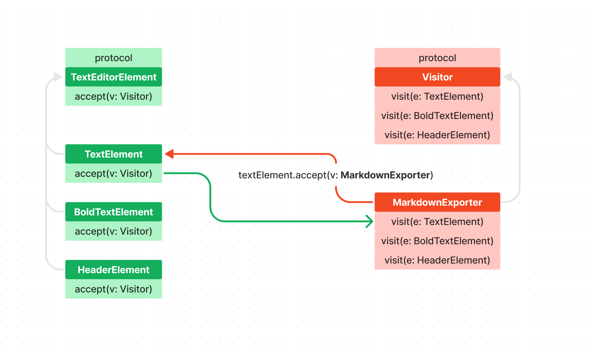

# Visitor

visitor 패턴은 어떠한 기능을 객체들로부터 분리해서 관리할 수 있도록 도와주는 패턴입니다.

정의만으로는 이해가 잘 가지 않으니 예를들어서 텍스트 에디터를 만들었다고 가정해 볼게요.

텍스트 에디터에 다양한 스타일도 넣고 싶어서 TextEditorElement라는 프로토콜을 만들고 이 프로토콜을 채택하는 Header, Text, BoldText 도 만들었다고 해볼게요!


그렇게 각 스타일에 맞게 꾸며서 잘 사용하고 있었습니다.

그런데 이 텍스트 에디터를 마크다운 문법으로 export 할 수 있도록 만들라는 요청이 떨어졌다고 해보겠습니다.

보통같으면 그냥 TextEditorElement 에
```func exportToMarkdown() -> String```
이렇게 추가해서 사용하거나 위 함수만을 가지고있는 protocol을 따로 만들어서 Concrete Element에 채택해서 사용할 것 같은데요

Visitor를 이용하여 구현하면 markdown 뿐만 아니라 더 다양한 방식의 exporter를 구축해야할 때 위 아이디어보다 더 유연하게 사용할 수 있게됩니다.

이는 Visitor 패턴의 특징인 기존 객체를 변경하지 않고 기능을 확장할 수 있다는 점에서 기인합는데요, 이거에 대해서도 뒤에서 다시 한 번 다뤄보도록 하죠.

<br>

## Visitor 패턴의 종특, IRL

Visotor 패턴을 구현하려면 이 패턴의 종특에 대해서 알아봐야겠죠?

- Visitor 패턴에는 내가 기능을 확장 시키려는 대상인 Element
- Element에 확장해서 구현하려던 구현체를 가지고있는 Visitor 이렇게 존재하게 됩니다.

Visitor는 기본적으로 Protocol이고 이를 채택하는 Concnrete visitor들을 구현한 후 Element에 visitor를 수용할 수 있는 ```accept(v: Visitor)``` 를 구현한 후 이 함수에서 visitor의 구현체인 ```visit(e: Element)```를 호출함과 동시에 self를 넘겨주면 됩니다.
이를
[더블 디스패치](https://en.wikipedia.org/wiki/Double_dispatch)
라고 하는데..

말이 좀 어렵죠? 코드 짜면서 조금씩 이해해 보자구요..

<br>

## IRL (In Real Life)

우리는 Markdown으로 TextElement를 export 할 수 있게 구현하려는 거니까 ConcreteVisitor가 Visitor 프로토콜을 채택한 MakrdownExporter 뭐 이렇게 구현할 수 있겠죠?

그리고 이 MakrdownExporter에 구현체를 구현해주면 됩니다.

```Swift
protocol Visitor {
  func visit(e: TextElement)
  func visit(e: HeaderElement)
  func visit(e: BoldTextElement)
}

class MarkdownExporter: Visitor {
  var markdown = ""
  
  func visit(e: TextElement) {
    markdown += "\n\(e.textField.text ?? "")"
  }
  
  func visit(e: HeaderElement) {
    markdown += "\n#\(e.textField.text ?? "")"
  }
  
  func visit(e: BoldTextElement) {
    markdown += "\n**\(e.textField.text ?? "")**"
  }
}
```

자 이렇게 visitor를 구현해줬으면 이 visitor를 사용하는 쪽도 구현해봐야겠죠?
바로 Element 쪽 말이죠!

Element에는 외부에서 Visitor를 주입받고 본인을 다시 visitor에게 넘겨주는 방식인데요, 통상적으로 함수의 이름은 ```accept(visitor: Visitor)``` 로 많이 쓰입니다.

어쨌든 Element에 이 visitor 즉 방문자를 받아줄 수 있는 창구를 구현해 줘보겠습니다.

```Swift
protocol TextEditorElement {
  var textField: UITextField { get set }
  func render() -> UIView
  func accept(visitor: Visitor)
}
```

그리고 이를 구현하는 쪽에서는 ```visitor.visit(e: self)``` 이런식으로 Visitor에서 구현한 구현체를 호출해줍니다.

```Swift
class TextElement: TextEditorElement {
  var textField = UITextField()
  
  func render() -> UIView {
    textField.font = .systemFont(ofSize: 16, weight: .regular)
    textField.placeholder = "내용을 입력해 주세요"
    return textField
  }
  
  func accept(visitor: Visitor) {  // 👈 일케
    visitor.visit(e: self) 
  }
}
```

그럼 만약 TextElement의 accept를 호출하면서 MarkdownExporter를 주입하면 자연스럽게 아까 위에서 구현했던 MarkdownExporter의 ```func visit(e: TextElement)```함수가 호출 되겠죠?

구조가 좀 헷갈릴 거라 생각이 드는데요, 시각적으로 표현하자면 아래와 같습니다.


이 시점에서 이 복잡한 구조를 굳이 사용해야하나..? 라는 의심이 점점 드셨을 겁니다.
자 그러면 만약 이 상태에서 XML exporter로 구현한다고 해보겠습니다.

그럼 아래와같은 구조로 만들어볼 수 있겠죠?


자 방금 새로운 XMLExpoter를 추가하는데 TextEditorElement는 건들이지도 않고 단순히 XMLExpoter를 새로 구현해준 후 accept()에 XMLExporter를 넣은것 만으로 기능 확장을 하였습니다!

이것이 바로 Visitor 패턴의 미덕.. 이랄까나요?

<br>
<br>

어쨌든 사용하는 모습을 보여드리자면 이렇습니다.

```Swift
let markdownExporter = MarkdownExporter()
markdownElements.forEach { element in
  element.accept(visitor: markdownExporter)
}
```

MarkdownExporter라는 visitor를 만들어서 각 element에 하나씩 돌아가면서 **'방문'** 하는 모습 보이죠? 이래서 visitor 라는 이름이 지어진 게 아닌가 싶네요!

<br>
<br>

## 예제 프로젝트 실행 결과


